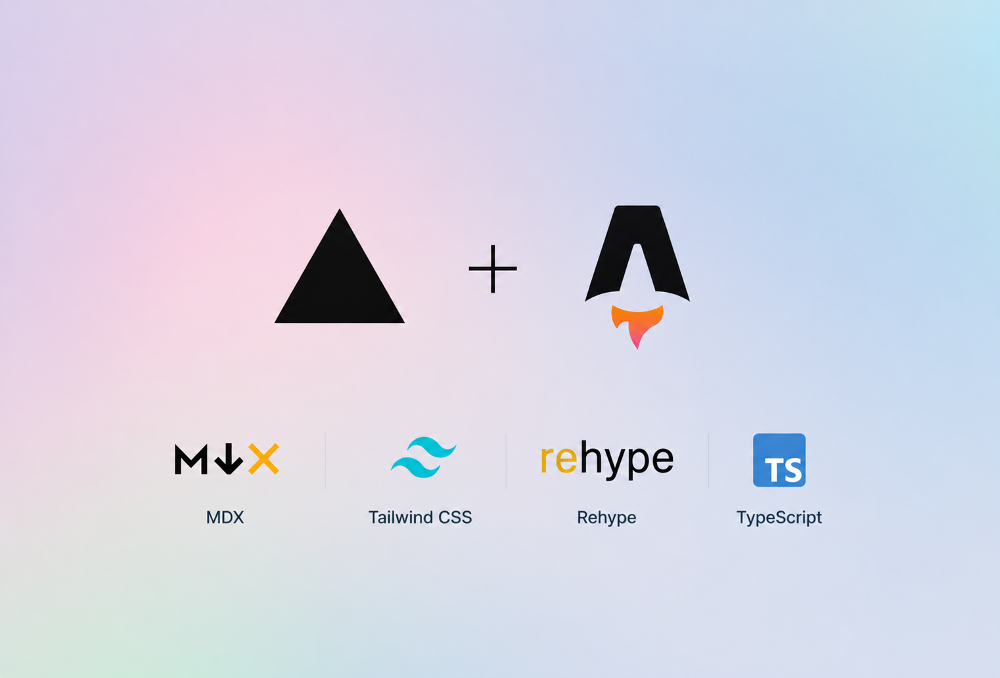

## mirsazzathossain.me

    

This is the source code for my personal site [mirsazzathossain.me](https://mirsazzathossain.me). It is an academic portfolio built with [Astro](https://astro.build/), using [React](https://react.dev/) for interactive islands where needed, and [Tailwind CSS v4](https://tailwindcss.com/) for styling. The visual design is inspired by the [Spotlight](https://spotlight.tailwindui.com/) theme from Tailwind UI. Articles and snippets live in Astro [content collections](https://docs.astro.build/en/guides/content-collections/) as MDX, with math via `remark-math` and `rehype-katex` (KaTeX CSS from the layout). [Giscus](https://giscus.app/) powers comments on posts. The site is deployed on [Vercel](https://vercel.com/) using [`@astrojs/vercel`](https://docs.astro.build/en/guides/integrations-guide/vercel/); `vercel.json` sets `"framework": "astro"` so the project is not mistaken for Next.js.

In short, the tech stack is:

- Framework: [Astro](https://astro.build/) (static output + Vercel adapter)
- UI islands: [React](https://react.dev/)
- Styling: [Tailwind CSS](https://tailwindcss.com/) v4
- Content: MDX via [@astrojs/mdx](https://docs.astro.build/en/guides/integrations-guide/mdx/)
- Deployment: [Vercel](https://vercel.com/)
- Comments: [giscus](https://giscus.app/)

## Overview

- `src/pages/*`: Astro routes.
- `src/components/*`: React and Astro components.
- `src/content/*`: MDX articles and snippets (content collections).
- `src/data/*`: Site data loaded at build time (JSON, BibTeX source); not exposed as separate static URLs.
- `public/*`: Static assets (favicon, manifest, images, and so on).
- `src/styles/*`: Global CSS (Tailwind entry + custom layers).
- `src/utils/*`: Shared utilities.
- `vercel.json`: Vercel framework preset (`astro`).
- `.github/workflows/ci.yml`: CI runs `npm ci` and `npm run build` on pushes and pull requests to `main`.

## Cloning and Forking

If you clone or fork this repository, replace or remove `src/data/*`, `src/content/*`, and personal assets under `public/` as needed.

```bash
git clone https://github.com/mirsazzathossain/mirsazzathossain.me.git
# or
git clone git@github.com:mirsazzathossain/mirsazzathossain.me.git
```

You can clear personal content with:

```bash
rm -rf src/content src/data
# Then add your own under src/content, src/data, and public/
```

## Installation

```bash
npm install
```

Start the dev server:

```bash
npm run dev
```

Open [http://localhost:4321](http://localhost:4321) in your browser (Astro’s default port).

Production build:

```bash
npm run build
```

### Environment variables

Create a `.env` for local development (or configure vars in Vercel) for integrations:

**Google Calendar** (powers the calendar widget):

```bash
PUBLIC_GOOGLE_API_KEY=...
PUBLIC_GOOGLE_CALENDAR_IDS=...
```

**OmniVault sync** (CI/CD only — not needed for local dev):

```bash
VAULT_TOKEN=...  # GitHub PAT with read access to the private omnivault repo
```

## Inspiration

- [Delba - delba.dev](https://delba.dev/)
- [Lee Robinson - leerob.io](https://leerob.io/)
- [Manu Arora - manuarora.in](https://manuarora.in/)
- [Tailwind Next.js Starter Blog](https://github.com/timlrx/tailwind-nextjs-starter-blog) (early inspiration; this repo is Astro-based.)

The layout and typography are influenced by the [Spotlight](https://spotlight.tailwindui.com/) theme from [Tailwind UI](https://tailwindui.com/).
